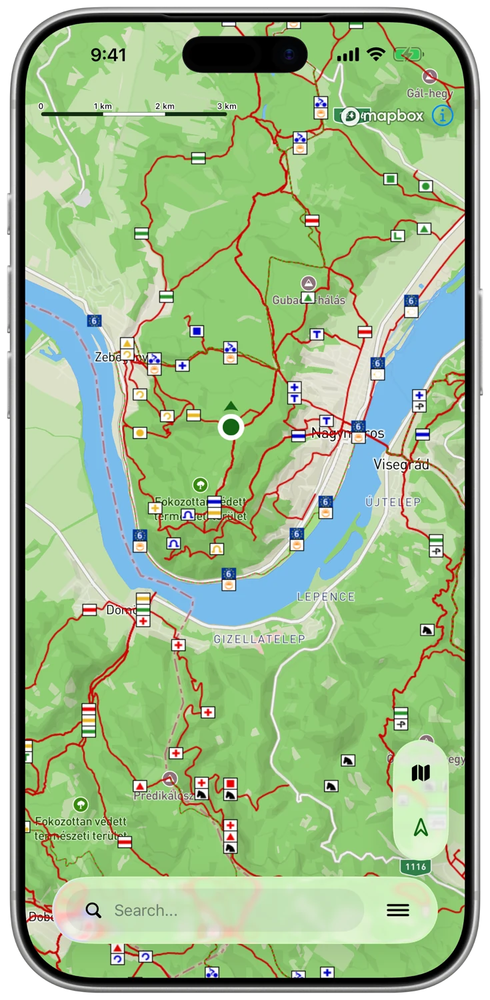
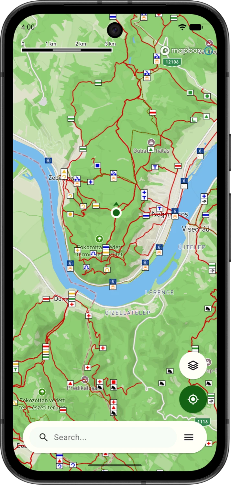

# HuKi-KMP - Hungarian Hiking Map #

[](https://github.com/RolandMostoha/HuKi-KMP/actions/workflows/github-workflow-android.yml)
[](https://github.com/RolandMostoha/HuKi-KMP/actions/workflows/github-workflow-ios.yml)
[](https://apps.apple.com/app/id6794327609)
[](https://github.com/RolandMostoha/HuKi-KMP/commits/main)

HuKi-KMP is a Kotlin Multiplatform project targeting Android and iOS.

The app helps you plan trips and discover the hiking trails of Hungary.

**HuKi-iOS** is released and available in App Store: https://apps.apple.com/app/id6794327609

<a href="https://apps.apple.com/app/id6794327609"></a>

**HuKi-Android v2.0 (KMP-based)** is not live yet, it will only replace "legacy" HuKi if the feature set comes
close to the legacy app.

**HuKi-Android v1.x (legacy - will be replaced)** is a live Android app:

- Implemented under: https://github.com/RolandMostoha/HuKi-Android
- Published on Google Play: https://play.google.com/store/apps/details?id=hu.mostoha.mobile.android.huki

<a href="https://play.google.com/store/apps/details?id=hu.mostoha.mobile.android.huki"></a>

## Screenshots

|                                   iOS                                   |                                   Android                                   |
|:-----------------------------------------------------------------------:|:---------------------------------------------------------------------------:|
|  |  |

## Goals

The project was born for the following reasons:

1. My personal entertainment - it's my beloved pet project in which I can try out tech outside of my job.
2. It comes in handy for hikers to have trips in Hungary. No need to download tiles or setup layers manually.
3. Learn and improve

## Project Overview

- **Domain**: Hiking application for Hungarian landscapes, trails, destinations.
- **Type**: Kotlin Multiplatform (KMP).
- **Target Platforms**: Android, iOS.
- **KMP approach**: "Do not share UI", so iOS UI is written in SwiftUI.
- **UI Frameworks**: Jetpack Compose for Android, SwiftUi for iOS.
- **Target Platform APIs**:
    - Android: minSdk=26, targetSdk=36
    - iOS: Xcode=26.1.1+, Deployment Target=18.2
- **Project Structure**:
    - `:composeApp`: Android native code.
    - `:iosApp`: iOS native code.
    - `:shared`: Shared kotlin code.
- **Supported app languages**: English, Hungarian.

## Plan board

Refer to [PLANNING.md](tools/planning/PLANNING.md).

## Tech stack & architecture & coding constraints

Refer to [AGENTS.md](AGENTS.md). It's the best place for humans too.

## Supporters


LocationIQ gives HuKi a very generous free plan to its Autocomplete and Geocoding APIs.

Huge thanks to the Location IQ team for the opportunity!

Services Used:

- Autocomplete API – Powers place search suggestions throughout the application, helping users quickly find destinations
  and POIs.
- Forward Geocoding API – Converts place names, addresses, and search queries into coordinates.
- Reverse Geocoding API – Powers features where converting coordinates into place information is necessary.

Website link: https://locationiq.com/

## Integration & Delivery

The project uses `GitHub Actions` to ensure code quality.

The following steps are running on the CI server on `main` push:

### Kotlin (shared code) + Android

1. Detekt - Static code analysis for Kotlin code
2. Ktlint - Enforces industry standard Kotlin style & formatting rules
3. Android Lint - Standard Android linter from Google
4. Compose Lints - Lint extension to avoid common Jetpack Compose mistakes
5. Unit tests
6. Android build
7. Android E2E UI tests - Using `Maestro`

```shell
./gradlew detekt ktlintCheck lint test assembleDebug maestro test
```

### iOS

1. SwiftLint - Enforces Swift style and conventions, warnings fail the build (`--strict`)
2. Xcode build
3. iOS E2E UI tests - Using `Maestro`

```shell
swiftlint --strict xcodebuild maestro test
```

## Testing

I'm a big fan of testing so the aim is to be fairly covered with Unit, Instrumentation and UI tests.

### Test types

1. Unit tests
2. Android Instrumentation tests - on-device tests without UI (e.g. Repository tests)
3. E2E tests with Maestro - on-device test with UI

### Unit tests

Kotlin based Unit tests for the shared code, using `Kotest` for assertions and `Turbine` for Flow testing.

**Android:**

```shell
./gradlew test
```

### Instrumentation tests (without UI)

Instrumentation tests are running on emulators/simulators but UI is not involved.

E.g.: Repository tests for DB, networking, files etc.

**Android:**

```shell
./gradlew connectedAndroidTest
```

### E2E UI tests

E2E UI tests require emulator/simulator and UI enabled.

Using `Maestro`, the goal here is "written-once, test both": wherever possible, one UI test case `yaml` is written for
both Android/iOS.

UI test cases are created under: `./.maestro/*.yml`

Running the tests:

```shell
maestro test
```

## Security

### Shared secrets

Shared API keys live in `secrets.properties` at the repo root (gitignored).

The `GenerateSecretsTask` Gradle task pastes property into a generated `Secrets.kt` object as `const val` declarations.

**Convention**: values in `secrets.properties` MUST be valid Kotlin string literals. E.g.:

```
LOCATION_IQ_API_KEY="pk.abc123"
```

Unquoted values will produce a `Secrets.kt` that fails to compile.

### MapBox

Personal `MapBox` access token is required to test the app's map related features.

The key is stored in an XML under `composeApp/src/main/res/values/mapbox_access_token.xml`.

The XML token is converted to GitHub secret with:

```shell
cat composeApp/src/main/res/values/mapbox_access_token.xml | base64
```

### Location IQ

Personal `LocationIQ` token is required to test the app's geocoding related features.

To get a personal token visit: https://locationiq.com

E.g.:

```
LOCATION_IQ_API_KEY="pk.abc123"
```

## Licence resources

- OpenStreetMap - https://www.openstreetmap.org/copyright
- Mapbox - Map engine - https://www.mapbox.com/
- Hungarian Hiking Layer (turistautak.openstreetmap.hu) - https://data2.openstreetmap.hu/
- Turistautak - https://turistautak.openstreetmap.hu/
- Location IQ - Search engine -  https://locationiq.com/

## Project License

```
MIT License

Copyright (c) 2020-2026 Roland Mostoha

Permission is hereby granted, free of charge, to any person obtaining a copy
of this software and associated documentation files (the "Software"), to deal
in the Software without restriction, including without limitation the rights
to use, copy, modify, merge, publish, distribute, sublicense, and/or sell
copies of the Software, and to permit persons to whom the Software is
furnished to do so, subject to the following conditions:

The above copyright notice and this permission notice shall be included in all
copies or substantial portions of the Software.

THE SOFTWARE IS PROVIDED "AS IS", WITHOUT WARRANTY OF ANY KIND, EXPRESS OR
IMPLIED, INCLUDING BUT NOT LIMITED TO THE WARRANTIES OF MERCHANTABILITY,
FITNESS FOR A PARTICULAR PURPOSE AND NONINFRINGEMENT. IN NO EVENT SHALL THE
AUTHORS OR COPYRIGHT HOLDERS BE LIABLE FOR ANY CLAIM, DAMAGES OR OTHER
LIABILITY, WHETHER IN AN ACTION OF CONTRACT, TORT OR OTHERWISE, ARISING FROM,
OUT OF OR IN CONNECTION WITH THE SOFTWARE OR THE USE OR OTHER DEALINGS IN THE
SOFTWARE.
```
