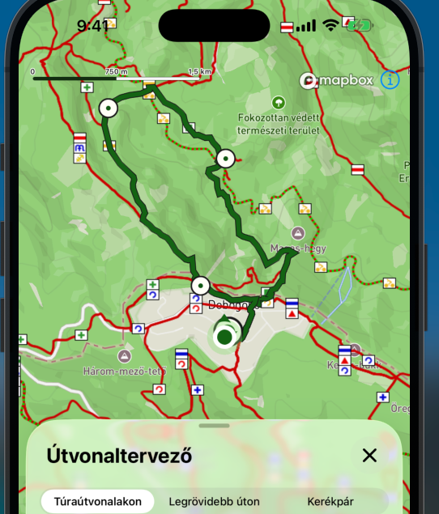

# HuKi-KMP — Plan Board

## Legend

| Status | Meaning                     |
|--------|-----------------------------|
| `[ ]`  | Not started                 |
| `[R]`  | Required for Next Release   |
| `[~]`  | In progress                 |
| `[x]`  | Done                        |
| `[-]`  | Cancelled / deprioritized   |
| `[?]`  | Questionable / spike needed |

---

## Most important features in HuKi

1. Map, text visibility
2. My location, GPS accuracy, navigating in trails, battery consumption
3. Layers (especially hiking Layer)
4. Search for places
5. Place Details
6. GPX
7. Route planner
8. Support / Billing
9. Destinations - Locally stored POIs (Peaks, Waterfalls, Valleys etc.)
10. OKT/AKT/RPDDK routes
11. Landscapes

## Release plan

### iOS Release #2 (v1.1)

Place Details, Route Planner

### Android Go-live

Android Go-Live: will only happen if legacy HuKi's feature set is mostly covered.

## Release

### Assets

| Status | Task                                      |
|--------|-------------------------------------------|
| `[ ]`  | App store preview video (optional)        |
| `[ ]`  | App store header picture/video (optional) |

### TestFlight & CD (R2: switch from manual App Store Connect to fastlane)

R1 was shipped entirely by hand (upload, metadata, screenshots). R2 automates it.
**Scope: iOS only** — Android stays manual until Android go-live (`composeApp` already reads
`versionCode`/`versionName` from `version.properties`, but there is no release signing config and no
`supply` metadata; both are go-live tasks, not R2).

**Already in place**: `version.properties` as the single version source; `:shared:generateVersionXcconfig`
→ `iosApp/Configuration/Version.xcconfig` (gitignored, `#include?`d from `Config.xcconfig`);
`iosApp/fastlane/metadata/` fully populated in `deliver` layout (`en-US` + `hu`).

**Signing — `.p12` in GitHub secrets + App Store Connect API key (not `match`).**
Certificates are capped (3 Apple Distribution per team) but provisioning profiles are not, and
GitHub-hosted runners are ephemeral: plain `-allowProvisioningUpdates` on an empty keychain mints a
**new certificate every run** and wedges the team after ~3 releases. Importing the distribution `.p12`
into the runner's keychain makes automatic signing reuse it, so the Mac and CI share **one**
certificate, the pbxproj keeps `CODE_SIGN_STYLE = Automatic`, and no certs repo is needed.
`match` solves the same problem with better housekeeping (encrypted certs repo, `match nuke` renewal)
at the cost of a second repo, `MATCH_PASSWORD`, and a switch to manual signing — adopt it only when a
second developer/signing machine appears, or when the yearly `.p12` re-export becomes annoying.

R1 shipped via Xcode Organizer's cloud-managed distribution signing (Apple holds the private key), so
there was no local distribution identity to export — one had to be created for CI. Current cert:
`Apple Distribution: Roland Mostoha (8PF8GK99M6)`, **expires 2027-08-20**.

#### Phase 1 — Headless-build prerequisites ✅ done

| Status | Task                                                                                                                                                                                                                                                                              |
|--------|-----------------------------------------------------------------------------------------------------------------------------------------------------------------------------------------------------------------------------------------------------------------------------------|
| `[x]`  | Shared the `iosApp` scheme → `iosApp.xcodeproj/xcshareddata/xcschemes/iosApp.xcscheme` (Archive action already targets Release; `.gitignore` already whitelisted the path)                                                                                                        |
| `[x]`  | Release device archive verified: `ARCHIVE SUCCEEDED`, arm64, `CFBundleShortVersionString=1.0` / `CFBundleVersion=4` — proves the version.properties → Version.xcconfig chain works in a Release archive                                                                           |
| `[x]`  | Ruby via `brew install ruby` → **4.0.6** (not 3.x); fastlane 2.238.0 runs on it. Gems install to `iosApp/vendor/bundle` via committed `iosApp/.bundle/config` (the shared Homebrew gem dir is not writable). Needs `export PATH="/opt/homebrew/opt/ruby/bin:$PATH"` in `~/.zshrc` |
| `[x]`  | `.gitignore`: `iosApp/vendor/`, `fastlane/report.xml`, `fastlane/README.md`, `fastlane/.env*`, `fastlane/screenshots/`, `metadata/*/release_notes.txt`, `*.ipa`, `*.dSYM.zip`, `*.xcarchive`, plus signing material (`*.p12`, `*.p8`, `*.cer`, `*.mobileprovision`)               |

#### Phase 2 — fastlane core (`gym` + `pilot` + `deliver`)

| Status | Task                                                                                                                                                                                                                                                                                                  |
|--------|-------------------------------------------------------------------------------------------------------------------------------------------------------------------------------------------------------------------------------------------------------------------------------------------------------|
| `[x]`  | `iosApp/fastlane/Appfile` — `app_identifier` + `team_id 8PF8GK99M6`. No `apple_id`: auth is API-key only, so no interactive Apple ID login path exists                                                                                                                                                |
| `[x]`  | App Store Connect API key created (`.p8`, App Manager role); stored as `IOS_ASC_KEY_P8_BASE64` / `IOS_ASC_KEY_ID` / `IOS_ASC_ISSUER_ID`                                                                                                                                                               |
| `[x]`  | Apple Distribution certificate created in Xcode (Settings → Accounts → Manage Certificates), exported as `.p12` with private key, stored as `IOS_DIST_CERT_P12_BASE64` / `IOS_DIST_CERT_PASSWORD`                                                                                                     |
| `[x]`  | Fastfile lane `beta`: API key → What's New guard → cert install (CI only, `is_ci`) → bump build number from TestFlight → `generateVersionXcconfig` → `build_app` (Release, `-allowProvisioningUpdates -skipPackagePluginValidation`, export `app-store`) → `upload_to_testflight` → Crashlytics dSYMs |
| `[x]`  | Fastfile lane `release`: `deliver` with `skip_binary_upload`, `force: true`, `submit_for_review`, `add_id_info_uses_idfa: false` (the IDFA question — correct for Firebase Analytics without ad attribution). **Blocked until Phase 3**: needs `release_notes.txt` + `fastlane/screenshots/`          |
| `[x]`  | `derived_data_path` pinned to `iosApp/build/DerivedData` so Crashlytics' SPM `upload-symbols` binary has a deterministic path                                                                                                                                                                         |
| `[R]`  | `iosApp/fastlane/.env` (gitignored) with the five env vars, for running lanes locally                                                                                                                                                                                                                 |
| `[R]`  | Smoke-test the API key read-only: `bundle exec fastlane run latest_testflight_build_number version:1.0`                                                                                                                                                                                               |
| `[R]`  | First real `fastlane beta` run → TestFlight (the end-to-end proof)                                                                                                                                                                                                                                    |
| `[ ]`  | Distribution cert expires **2027-08-20** → re-export `.p12` and update the secret (or migrate to `match` then)                                                                                                                                                                                        |

#### Phase 3 — Version + changelog automation (kills the manual store data entry)

| Status | Task                                                                                                                                                                                                                                                                                                                                                                                                                                                                                                                                                                       |
|--------|----------------------------------------------------------------------------------------------------------------------------------------------------------------------------------------------------------------------------------------------------------------------------------------------------------------------------------------------------------------------------------------------------------------------------------------------------------------------------------------------------------------------------------------------------------------------------|
| `[x]`  | Gradle task `generateStoreReleaseNotes` (`buildSrc`) renders `whatsnew-en-US.md` → `fastlane/metadata/en-US/release_notes.txt` and `whatsnew-hu-HU.md` → `metadata/hu/release_notes.txt`, strips the `-`/`*` bullet markers exactly like `WhatsNewMapper` and re-emits them as `•`, validates the 4000-char App Store cap. Standalone (not wired into compilation) — the `release` lane invokes it. Declares the two files as `@OutputFile`s rather than the metadata dir as `@OutputDirectory`, so Gradle stale-output cleanup can never delete the hand-written metadata |
| `[x]`  | **No sync script needed** — `tools/screenshots/{iOS,iPad13}/` moved into `iosApp/fastlane/screenshots/en-US/` + `hu/`, so the committed files *are* the store assets. Both sizes are in `deliver`'s supported list (iPhone 6.3" `1206x2622`, iPad 13" `2064x2752`); it infers device class from pixel size and orders by filename. AppMockUp sources stay in `tools/screenshots/appmockup/`                                                                                                                                                                                |
| `[x]`  | Fastfile `version_property` reads root `version.properties`; `preflight_version` validates it against App Store Connect. The `verify` lane runs the same check read-only as a dry run                                                                                                                                                                                                                                                                                                                                                                                      |
| `[x]`  | `beta` lane guard: fails fast if `tools/release/whatsnew/v<appVersion>/` is missing (before a 20-min archive)                                                                                                                                                                                                                                                                                                                                                                                                                                                              |
| `[x]`  | `metadata/review_information/notes.txt` — the fenced block from `tools/release/app_review_notes.md` moved here (that staging file is deleted; `deliver` reads this one). Global dir, not per-locale. The six contact/demo files (`first_name`, `last_name`, `phone_number`, `email_address`, `demo_user`, `demo_password`) are **gitignored** — the repo is public and those values already live in App Store Connect; `deliver` leaves a field untouched when its file is absent                                                                                          |

#### Phase 4 — CD on GitHub Actions

| Status | Task                                                                                                                                                                                                                                                                                                                                                                                                                                                                                                                                                                                                                 |
|--------|----------------------------------------------------------------------------------------------------------------------------------------------------------------------------------------------------------------------------------------------------------------------------------------------------------------------------------------------------------------------------------------------------------------------------------------------------------------------------------------------------------------------------------------------------------------------------------------------------------------------|
| `[x]`  | `.github/workflows/github-workflow-ios-release.yml` — `push: tags: ['ios/v*']` + `workflow_dispatch`, `concurrency: cancel-in-progress: false` (never kill a release mid-upload), reuses `checkout-with-secrets/ios`                                                                                                                                                                                                                                                                                                                                                                                                 |
| `[x]`  | Repo secrets: `IOS_DIST_CERT_P12_BASE64`, `IOS_DIST_CERT_PASSWORD`, `IOS_ASC_KEY_P8_BASE64`, `IOS_ASC_KEY_ID`, `IOS_ASC_ISSUER_ID`                                                                                                                                                                                                                                                                                                                                                                                                                                                                                   |
| `[x]`  | Job: tag↔`appVersion` guard → Xcode/Java/Gradle → `ruby/setup-ruby` 4.0 with `bundler-cache` (`working-directory: iosApp`) → `fastlane beta` (upload, internal TestFlight, no review) → `fastlane release` (metadata **staged**, `submit_for_review: false`) → `.ipa`/`.dSYM` artifacts (30d), gym logs on failure                                                                                                                                                                                                                                                                                                   |
| `[x]`  | `upload_symbols_to_crashlytics` wired into the `beta` lane — otherwise R2 crash reports arrive unsymbolicated                                                                                                                                                                                                                                                                                                                                                                                                                                                                                                        |
| `[R]`  | Verify on the first CI run: the `upload-symbols` SPM path resolves, and `import_certificate` works on an ephemeral runner (both only exercised when `is_ci` is true)                                                                                                                                                                                                                                                                                                                                                                                                                                                 |
| `[x]`  | **Decided — `version.properties` is the source of truth; fastlane reads it and never writes it.** `preflight_version` validates both things App Store Connect would reject, in ~2s before the archive: `appVersion` must exceed the live App Store version (`get_live_app_store_version`), and `iosBuildNumber` must exceed `latest_testflight_build_number` for that version. Bumping both is a manual release step. No file mutation → clean working tree, no CI write-back, same commit always ships the same version. The live-version lookup degrades to a warning if it fails, so it can never block a release |

#### Phase 5 — Docs

| Status | Task                                                                                                                        |
|--------|-----------------------------------------------------------------------------------------------------------------------------|
| `[R]`  | `AGENTS.md`: Release section (`bundle exec fastlane beta` / `release`, secrets, Ruby/PATH setup, version bump flow)         |
| `[ ]`  | `iosApp/fastlane/metadata/README.md`: TODO list is stale (URLs/categories are filled); point screenshots at the sync script |
| `[ ]`  | `tools/screenshots/SCREENSHOTS.md`: reference `ios_sync_store_screenshots.sh`                                               |

## Backlog

### General / tech tasks

| Status | Feature                                                                                                                                            |
|--------|----------------------------------------------------------------------------------------------------------------------------------------------------|
| `[ ]`  | Change app icon in Google Play Store for Legacy HuKi                                                                                               |
| `[ ]`  | Change feature graphic in Google Play Store                                                                                                        |
| `[ ]`  | SwiftUi previews don't work atm, because of Mapbox startup init blocks                                                                             |
| `[ ]`  | SwiftUi Sheets -> auto-measure height to avoid defining expanded state for every sheet, it kills 6 of the 8 constants including both iPad branches |
| `[ ]`  | Update Kotlin + Gradle 9                                                                                                                           |
| `[ ]`  | Sonar? free for open source projects                                                                                                               |
| `[ ]`  | Check project against Swift agent skills in XCode                                                                                                  |
| `[ ]`  | GitHub smart labels, E.g.: https://github.com/balazsgerlei/ScreenLit/blob/main/README.md?plain=1                                                   |

### Bugs

| Status | Scope      | Bug                                                                                                                                                                                                                                                                                                             |
|--------|------------|-----------------------------------------------------------------------------------------------------------------------------------------------------------------------------------------------------------------------------------------------------------------------------------------------------------------|
| `[R]`  | Map        | Bug: The GPX route on map, Start / End destinations should be always on top compared to Waypoint / Middle points (marker placement order issue)                                                                                                                                                                 |
| `[ ]`  | Search     | Bug: Android. DestinationsSection->overscrollEffect = null is used because of this bug. LazyRow shows spurious stretch-overscroll mid-list on fling (cards widen/shake even when not at an edge). Only on fling, not on controlled drag (scroll-to-stop). (possibly a Compose foundation fling/overscroll bug). |
| `[ ]`  | Search     | Bug: Android. Sheets closing animations dont work clicing on X, it just flashes down.                                                                                                                                                                                                                           |
| `[ ]`  | Search     | UI Bug: Android. In GpxCollection + Settings, it use group dividers as separators, it's more like iOS design, it should be transparent sapces instead. (cmt: latest Android SDK shows no spaces, as iOS...)                                                                                                     |
| `[ ]`  | MyLocation | There is no hard timeout for a location fix. If My Location button is clicked and location fix doesnt come, it loads inifinitely. After a fixed timeout, we should show an alert "Couldn't find location, try again later"                                                                                      |
| `[ ]`  | CI         | Bug: iOS Simulator 18 is used (preferred: 26) and only smoke test suite is runnable on CI                                                                                                                                                                                                                       |

### FEATURE: Map

| Status | Scope | Task                                                                              |
|--------|-------|-----------------------------------------------------------------------------------|
| `[ ]`  | Map   | After state restoration / app kill -> restore last camera state + last opened GPX |
| `[ ]`  | Map   | Bug: GPX Menu -> Overview -> applies a big bottom padding, not necessary          |

### FEATURE: Camera panel

Inspired by DEBUG_SHOW_CAMERA_PANEL, add this as a usable feature for users. This might be useful,
they can record their exact location / zoom level with a CROSS marker.

### FEATURE: Dark Mode

| Status | Scope    | Bug                                                                                                                                   |
|--------|----------|---------------------------------------------------------------------------------------------------------------------------------------|
| `[ ]`  | DarkMode | Bug, iOS 27, found in beta. In dark mode GPX color is too bright, barely readable  |

### FEATURE: Landscape

| Status | Feature                                                                                                     |
|--------|-------------------------------------------------------------------------------------------------------------|
| `[ ]`  | Add Previews to Landscape / Tablet view                                                                     |
| `[ ]`  | iOS: In Landscape: Mapbox scale bar should be less wide (Android works fine, Mapbox had a built-in option)  |
| `[ ]`  | In Landscape: Mode, use Glass Panel for Layers Sheets instead of full screen sheet.                         |
| `[?]`  | In Landscape: Move the sheet to left to match Apple Maps behavior, so Map is more visible in the right side |
| `[ ]`  | Add extra padding to floating action in iPad mode, there is a lot of space                                  |
| `[ ]`  | iPad: Use overlay panels instead of Sheets -> they show up in the center of the screen                      |

### FEATURE: My Location

| Status | Scope      | Task                                                                                                                                                                                                                                            |
|--------|------------|-------------------------------------------------------------------------------------------------------------------------------------------------------------------------------------------------------------------------------------------------|
| `[ ]`  | MyLocation | Show altitude somewhere                                                                                                                                                                                                                         |
| `[ ]`  | MyLocation | Location permission rationale screen: show a "why we need location" priming screen before the OS prompt (and a denied → open-Settings recovery path). Measure via permission-funnel analytics (grant/deny before & after) to validate the lift. |

### FEATURE: Layers

| Status | Scope  | Task                                                                                                                                         |
|--------|--------|----------------------------------------------------------------------------------------------------------------------------------------------|
| `[ ]`  | Layers | Save picked layer state permanently for users (UserPreferencesRepository). E.g. picked layer -> Satellite, it saves for the next app launch. |

### FEATURE: Search

| Status | Scope  | Task                                                                                   |
|--------|--------|----------------------------------------------------------------------------------------|
| `[ ]`  | Search | Show GPX Trail collection (Természetjáró, AktívMagyarország)                           |
| `[ ]`  | Search | No mic/voice icon. Search by voice Consider adding one between the text and hamburger. |
| `[ ]`  | Search | In-memory LRU cache keyed by Request                                                   |

### FEATURE: Destinations

| Status | Scope        | Task                                       |
|--------|--------------|--------------------------------------------|
| `[ ]`  | Destinations | Add Map based destinations with Landscapes |
| `[ ]`  | Destinations | Improve destinations descriptions          |

### FEATURE: Versioning + WhatsNew

| Status | Scope    | Task                                                                                                      |
|--------|----------|-----------------------------------------------------------------------------------------------------------|
| `[ ]`  | WhatsNew | In user pereferences save the user INSTALL date.                                                          |
| `[ ]`  | WhatsNew | Add "Follow on Facebook" section to WhatsNew's bottom.                                                    |
| `[ ]`  | WhatsNew | Version history screen under Settings: list every release + date + notes (uses the full `releases` list). |

### FEATURE: GPX Distance

Goal: Display (distance + time) in an InfoWindow on top Start / End / Middle waypoints.

| Status | Scope       | Task                                                                                                                                                                             |
|--------|-------------|----------------------------------------------------------------------------------------------------------------------------------------------------------------------------------|
| `[ ]`  | GPXDistance | When I intentionally go off the trail, it still snaps and show distance, its misleading. We can show a direct line to the route (with a label "+100m") or offer "Wandering mode" |

### FEATURE: GPX

| Status | Scope | Task                                                                              |
|--------|-------|-----------------------------------------------------------------------------------|
| `[ ]`  | GPX   | Wire iOS file picker error branch to ViewModel                                    |
| `[ ]`  | GPX   | Colored GPX                                                                       |
| `[ ]`  | GPX   | Display direction arrows. Add an option to toggle direction in GpxMenu            |
| `[ ]`  | GPX   | Display waypoint comments in a window                                             |
| `[ ]`  | GPX   | ? Display start and end location: "Around Bükk..." -> on import we can do geocode |

### FEATURE: GPX Details

| Status | Scope      | Task                                      |
|--------|------------|-------------------------------------------|
| `[x]`  | GPXDetails | Show as secondary button "Share GPX file" |

### FEATURE: GPX Collection

| Status | Scope         | Task                                                        |
|--------|---------------|-------------------------------------------------------------|
| `[x]`  | GPXCollection | Implement share                                             |
| `[ ]`  | GPXCollection | Implement rename                                            |
| `[ ]`  | GPXCollection | "Imported vs Route Planner" badges / chips OR icon to start |
| `[ ]`  | GPXCollection | Searchbar, free search text by gpx name                     |
| `[ ]`  | GPXCollection | Filter by distance, open date                               |
| `[ ]`  | GPXCollection | "Mark Completed" GPX files                                  |

### FEATURE: Place Details (from Search + Long Tap)

| Status | Scope        | Task                                                                                                                                                    |
|--------|--------------|---------------------------------------------------------------------------------------------------------------------------------------------------------|
| `[x]`  | PlaceDetails | On long click show a PlacePicker marker                                                                                                                 |
| `[x]`  | PlaceDetails | Also how PlaceDetails sheet                                                                                                                             |
| `[x]`  | PlaceDetails | Reverse geocode with LocationIQ                                                                                                                         |
| `[x]`  | PlaceDetails | Show content what is already shown with autocomplete: @Place model                                                                                      |
| `[x]`  | PlaceDetails | Handle reverse geocode failure (offline / rate limit) in the sheet                                                                                      |
| `[x]`  | PlaceDetails | Wire LONG_TAP as PlaceSource and save it in place history                                                                                               |
| `[x]`  | PlaceDetails | Wire PlaceDetails into Search autocomplete selection to `PlaceDetails.Loaded(place)`                                                                    |
| `[x]`  | PlaceDetails | If PlaceDetails opened from autocomplete and bounding box, the sheet can overlap with the marker. Need Sheet based Map bottom offset as in GPX Details. |
| `[x]`  | PlaceDetails | Wire PlaceDetails into Destinations                                                                                                                     |
| `[R]`  | PlaceDetails | Wire the Route plan button to the Route Planner                                                                                                         |
| `[ ]`  | PlaceDetails | Search nearby button                                                                                                                                    |
| `[ ]`  | PlaceDetails | Allow dragging the marker to refine the pick (re-geocode on drop)                                                                                       |
| `[ ]`  | PlaceDetails | Add Destinations' descriptions and category to Place Details                                                                                            |

### FEATURE: PlaceHistory

| Status | Scope        | Task                                                                                |
|--------|--------------|-------------------------------------------------------------------------------------|
| `[ ]`  | PlaceHistory | Add the PlaceSource indicator (long-tap, destinations etc.) to place history screen |

### FEATURE: Route Planner

- Graphhopper API
- Most of the code can be reused from legacy HuKi
- Storage: `gpx/routeplanner/` (sibling of `gpx/external/`)

| Status | Scope        | Task                                                                                                                                                                                                                                                                                                                                                                                                                                                                                                                                                                                      |
|--------|--------------|-------------------------------------------------------------------------------------------------------------------------------------------------------------------------------------------------------------------------------------------------------------------------------------------------------------------------------------------------------------------------------------------------------------------------------------------------------------------------------------------------------------------------------------------------------------------------------------------|
| `[x]`  | RoutePlanner | iOS Route Planner sheet UI (profiles, waypoints, toolbar, stats, save) — no map/routing                                                                                                                                                                                                                                                                                                                                                                                                                                                                                                   |
| `[x]`  | RoutePlanner | Graphhopper routing network layer + iOS loading/error states and route stats                                                                                                                                                                                                                                                                                                                                                                                                                                                                                                              |
| `[x]`  | RoutePlanner | On Long tap, add a new waypoint to the route                                                                                                                                                                                                                                                                                                                                                                                                                                                                                                                                              |
| `[x]`  | RoutePlanner | On swipe down have a minimized state (detent) of the route planner which shows only: Title, X, Stats, Save. Swipe down doesn't exit the route planner.                                                                                                                                                                                                                                                                                                                                                                                                                                    |
| `[x]`  | RoutePlanner | Add support for removing stops from WaypointRows. Add an X button to the left of drag handle icon, which removes the stop from the plan.                                                                                                                                                                                                                                                                                                                                                                                                                                                  |
| `[x]`  | RoutePlanner | Do reverse geocode on every new waypoints added. Use the same geocoding logic as in Place Details -> so if there is no response on time or failure, use coordinates as we do atm                                                                                                                                                                                                                                                                                                                                                                                                          |
| `[x]`  | RoutePlanner | On "Add new stop" -> Show a RoutePlannerSearchSheet - stacked detent.large sheet on top of RoutePlanner.                                                                                                                                                                                                                                                                                                                                                                                                                                                                                  |
| `[x]`  | RoutePlanner | RoutePlannerSearch content: Back button displayed. Title: "Add new stop". Content: 1. SearchBar input -> similar like SearchSheet, 2. "My actual location" - secondary button, 3. "On map with long tap" - secondary button - it dismisses the RoutePlanSearch and minimizes the RoutePlanSearch, 4. Recent Places from PlaceHistory. 5. Online Results from LocationIQ places, similar to SearchSheet                                                                                                                                                                                    |
| `[x]`  | RoutePlanner | RoutePlannerSearch: "Nearby destinations" section - closest destinations within 30 km, hidden when there are none                                                                                                                                                                                                                                                                                                                                                                                                                                                                         |
| `[x]`  | RoutePlanner | REVERT (-roundtrip icon is confusing for start / end waypoint rows): If the route plan is a roundtrip, use the reoundtrip icon instead of start wp [img.png](img.png)                                                                                                                                                                                                                                                                                                                                                                                                                     |
| `[x]`  | RoutePlanner | Add guard if "Route Plan" was clicked from Place Details and my location is too far away >50km -> this case leave the starting WP empty so user can pick it up                                                                                                                                                                                                                                                                                                                                                                                                                            |
| `[x]`  | RoutePlanner | Both SearchSheet + RoutePlannerSearchSheet -> Name the section as Közeli kirándulóhelyek/Nearby Destinations. Instead of ordering by my location distance, order by the camera center location. This way the user can search for destinations nearby the actual map position. E.g. i'm in budapest but I plan a trip in Bakony so Map is opened in Bakony and I want to see close destinations.                                                                                                                                                                                           |
| `[x]`  | RoutePlanner | Cap waypoints at 10. Add a warning status message, "You've reached the max destination count" -> Add new stop is hidden.                                                                                                                                                                                                                                                                                                                                                                                                                                                                  |
| `[x]`  | RoutePlanner | Dispplay route plan markers on top the my location marker. The waypoint cannot be seen if it overlaps with my location                                                                                                                                                                                                                                                                                                                                                                                                                                             |
| `[x]`  | RoutePlanner | Save created routes to `gpx/routeplanner/` (sibling of `gpx/external/`) as a GPX file. This file must be browsable by GPX History/Recent GPXs.                                                                                                                                                                                                                                                                                                                                                                                                                                            |
| `[x]`  | RoutePlanner | GPX name / GPX file name generation.                                                                                                                                                                                                                                                                                                                                                                                                                                                                                                                                                      |
| `[x]`  | RoutePlanner | HuKI must be added somewhere in the GPX file as a "watermark".                                                                                                                                                                                                                                                                                                                                                                                                                                                                                                                            |
| `[x]`  | RoutePlanner | After Route Plan GPX was successfully saved, open it as a standard GPX (GpxDetails)                                                                                                                                                                                                                                                                                                                                                                                                                                                                                                       |
| `[x]`  | RoutePlanner | Android impl                                                                                                                                                                                                                                                                                                                                                                                                                                                                                                                                                                              |
| `[x]`  | RoutePlanner | In GPX History differentiate route plans vs external GPX files by a leading Icon, in front of title/subtitle. External: "download" icon. RoutePlanner: "hand icon". Icon bg: sceondary color                                                                                                                                                                                                                                                                                                                                                                                              |
| `[x]`  | RoutePlanner | Maestro E2E flow (`maestro_route_planner.yaml`) — runs unguarded on both platforms                                                                                                                                                                                                                                                                                                                                                                                                                                                                                                        |
| `[x]`  | RoutePlanner | iOS: `RoutePlannerViewModel` leaks one instance per planner open — `onCleared` never runs on iOS and nothing calls `clear()`. `.onDisappear` in `RoutePlannerSheetView` does NOT work: the stacked search sheet fires it too, and `clear()` cancels the scope irreversibly (plan stops loading, X stops working — caught by `maestro_route_planner.yaml`). Fix: hoist the VM to `MainView` and clear it from the presenter's `.sheet(onDismiss:)`, keyed on `presentedSheet` so other sheets don't recreate it. Do it together with the Android impl, which reworks this plumbing anyway. |
| `[x]`  | RoutePlanner | Add "Route Plan" feature to Menu. Opening RP from menu will init with empty WPs. Icon is the same as coming from Place Details -> Route Plan button                                                                                                                                                                                                                                                                                                                                                                                                                                       |
| `[x]`  | RoutePlanner | Have a Share button on GPX details. Share via share sheet (iOS ShareLink / Android ACTION_SEND + FileProvider)                                                                                                                                                                                                                                                                                                                                                                                                                                                                            |
| `[x]`  | RoutePlanner | Add a dedicated error message if Graphhopper daily limit is reached. "We've reached the route planner service daily limit. Please try it tomorrow."                                                                                                                                                                                                                                                                                                                                                                                                                                       |
| `[ ]`  | RoutePlanner | Android: the planner loses its stops on a configuration change (rotation, dark-mode toggle) — `rememberScopedViewModelStoreOwner` does not survive one. Fix with `rememberViewModelStoreOwner` once the project is on AGP 9.1 / compileSdk 37 (androidx.lifecycle 2.11.0).                                                                                                                                                                                                                                                                                                                |
| `[ ]`  | RoutePlanner | Android: a long/fast swipe down on the planner sheet targets Hidden, which the dismiss guard rejects, so it snaps back to expanded instead of minimizing. A moderate drag minimizes correctly.                                                                                                                                                                                                                                                                                                                                                                                            |
| `[ ]`  | RoutePlanner | Verify the iOS Maestro flow — the local iOS driver fails in `setPermissions` ("Device became unreachable"), unrelated to the app; the Android run passes unguarded.                                                                                                                                                                                                                                                                                                                                                                                                                       |
| `[ ]`  | RoutePlanner | Add guard if "Route Plan" next destination is too far away >50km -> Show a warning message, the stop is too far away                                                                                                                                                                                                                                                                                                                                                                                                                                                                      |
| `[ ]`  | RoutePlanner | In-memory LRU cache keyed by RoutePlanRequest (profile + waypoints),                                                                                                                                                                                                                                                                                                                                                                                                                                                                                                                      |
| `[ ]`  | RoutePlanner | Add an eye icon to route plan so you can "look behind" the plan and see where the hikings routes are.                                                                                                                                                                                                                                                                                                                                                                                                                                                                                     |
| `[ ]`  | RoutePlanner | Deploy Graphhopper RoutePlanner (HuKi-Routing) to AWS Lightsail.                                                                                                                                                                                                                                                                                                                                                                                                                                                                                                                          |
| `[?]`  | RoutePlanner | Use GH GZIP (poinstEncoded=true) for release builds. Client parser is needed                                                                                                                                                                                                                                                                                                                                                                                                                                                                                                              |
| `[?]`  | RoutePlanner | Add support for removing stops from Map during RoutePlan phase. If users click on the wps, there should be a toolbar "Delete Stop" button, which removes the waypoint.                                                                                                                                                                                                                                                                                                                                                                                                                    |
| `[?]`  | RoutePlanner | Add support for converting to round trip through MAP. If users click on the START WP, there should be a toolbar "Finish with round trip" button, which adds the first wp as the last one.                                                                                                                                                                                                                                                                                                                                                                                                 |

### FEATURE: Settings

| Status | Scope    | Task                                                                    |
|--------|----------|-------------------------------------------------------------------------|
| `[ ]`  | Settings | Add Increase map font size in Settings (see FEATURE: Map Label Scaling) |
| `[ ]`  | Settings | Add Theme (light/dark/system) in Settings                               |
| `[ ]`  | Settings | Add Enable/Disable two finger rotation                                  |

### FEATURE: Analytics

| Status | Scope     | Task                                                                                                                |
|--------|-----------|---------------------------------------------------------------------------------------------------------------------|
| `[ ]`  | Analytics | My Location: No-signal / GPS lost                                                                                   |
| `[ ]`  | Analytics | Search with no results                                                                                              |
| `[ ]`  | Analytics | GPX as params: attach distance_km and waypoint_count as params                                                      |
| `[ ]`  | Analytics | whats_new_shown, whats_new_dismissed                                                                                |
| `[ ]`  | Analytics | Offline - somehow monitor if user goes offline -> really helpful measurement, how many ppl experiencing it on hikes |

### FEATURE: Map Label Scaling (Global Scale Factor)

Goal: let users increase map **label/icon size** without enlarging the map graphics (roads, fills,
casings) — a text-visibility + accessibility win for the #1 feature "Map, text visibility".

Only affects icons + text labels; map geometry stays the same and zoom interpolation is preserved
by the renderer (no per-layer `text-size` expression juggling).

Approach: Mapbox's **global scale factor**, exposed on Android Compose as
`mapboxMap.symbolScaleBehavior` (set via `MapEffect`), with three modes:

Blockers:

- **Version gap**: requires Mapbox **11.26.0** (Android + iOS). We are pinned to **11.20.1** in
  `libs.versions.toml` / the iOS pod, so this needs an SDK bump + map re-verify on both platforms.
- **Experimental**: `symbolScaleBehavior` is flagged experimental/`@MapboxExperimental` and the
  signature may change in a later 11.x.

Refs:
[Mapbox blog — new scaling/styling](https://www.mapbox.com/blog/new-scaling-and-styling-capabilities-support-clear-responsive-and-expressive-map-design)
[Android Compose example](https://docs.mapbox.com/android/maps/examples/compose/global-scale-factor/)

| Status | Scope    | Task                                                                                          |
|--------|----------|-----------------------------------------------------------------------------------------------|
| `[ ]`  | Map      | Bump Mapbox SDK to 11.26.0+ (Android + iOS pod), re-verify map screens on both platforms      |
| `[ ]`  | Map      | Confirm the iOS SwiftUI equivalent of `symbolScaleBehavior` and wire it in `MapContent` (iOS) |
| `[ ]`  | Settings | Add label-size preference to `AppSettings` + DataStore (Fixed factor and/or System/Custom)    |
| `[ ]`  | Settings | Settings UI control (slider or presets) feeding the map scale factor                          |
| `[ ]`  | Map      | Apply `symbolScaleBehavior` in Android `MapContent` via `MapEffect` from the settings value   |
| `[ ]`  | Map      | Default to `SymbolScaleBehavior.system` so it respects OS accessibility font scale out of box |

### FEATURE: Support + Billing

- Support + Billing is necessary to help me keep the app free for everyone and support the
  development.
- Google: Google Play Billing API
- Apple: Apple App Store Connect, Apple Pay
- Base concept: subscriptions and one time payments. Categorized by wild animals (e.g.
  Board=1EUR/month, Owl=1EUR).
- The benefit of supporting is just visual: showing the supporter animal in various places (e.g.
  WhatsNew)

#### FEATURE: Route Planner: Wandering mode

Goal: Set a single starting point (e.g. parking), and show the straight line distance from the point.
Works like a GPX with waypoints only, set a few points and leave the user to decide which route to follow.

### FEATURE: GPX Info Panel (remaining time, distance, elevation gain/loss)

| Status | Scope    | Task                                           |
|--------|----------|------------------------------------------------|
| `[ ]`  | GpxPanel | Use GPX panel on Start / GPX Details -> hidden |
| `[ ]`  | GpxPanel | Elapsed time                                   |
| `[ ]`  | GpxPanel | Distance from Start                            |
| `[ ]`  | GpxPanel | Distance from End                              |
| `[ ]`  | GpxPanel | AVG Speed                                      |
| `[ ]`  | GpxPanel | Expected arrival based on dist/AVG speed       |

### FEATURE: GPX Collection Import/Export (device-to-device, no cloud)

Goal: share/back up the whole GPX collection between devices without cloud or auth.
Principle: separate **format** (a portable collection file) from **transport** — let the OS own
transport (AirDrop, Quick Share, Bluetooth, Files/USB, email, chat). A zipped bundle is plain data,
so an Android export imports on iOS and vice-versa.

| Status | Scope      | Task                                                                                               |
|--------|------------|----------------------------------------------------------------------------------------------------|
| `[ ]`  | GPX Export | `GpxCollectionArchiver` (expect/actual): zip `gpx/external` + generated `manifest.json`            |
| `[ ]`  | GPX Export | Export action → native share sheet (iOS ShareLink / Android ACTION_SEND + FileProvider)            |
| `[ ]`  | GPX Import | `GpxCollectionArchiver` unzip to temp, then loop each `.gpx` through `GpxStorage.saveToFileSystem` |
| `[ ]`  | GPX Import | iOS: declare imported/exported UTI + `CFBundleDocumentTypes`, handle inbound via `.onOpenURL`      |
| `[ ]`  | GPX Import | Android: `<intent-filter>` ACTION_VIEW/ACTION_SEND for `.hukigpx`/zip, read URI in `onNewIntent`   |
| `[ ]`  | GPX Import | Extend existing file pickers to also accept `.hukigpx`/`.zip`                                      |
| `[ ]`  | GPX Import | Manifest-driven import preview/summary ("X new, Y duplicates")                                     |
| `[ ]`  | GPX Import | iOS unzip needs a lib (ZIPFoundation via SPM or libarchive); Android uses `java.util.zip`          |

### FEATURE: Menu - Guides

Goal: a new section in Menu, with 1 page guides of different topics.

| Status | Scope  | Task                                      |
|--------|--------|-------------------------------------------|
| `[ ]`  | Guides | Add "Problem on route" to Guides section. |
| `[ ]`  | Guides | Route Planner                             |

#### Guides: Report problem on route

- Use MTSZ (Magyar Természetjáró Szövetség) email's to report a problem
- Include location (latitude, longitude)
- Possible link to openstreetmap.org which include the problematic point

### TECH: iOS Mapbox viewport deprecation (ViewportObserver → `$viewport` binding)

`MapProxy.viewport` (the imperative `ViewportManager`) is deprecated in Mapbox 11.20 →
`'viewport' is deprecated: Use Map(viewport:) initializer instead.` This is what
`MapView.swift` uses via `proxy.viewport?.addStatusObserver(viewportObserver)` in
`onAppear`/`onDisappear`, plus the whole `UI/Mapbox/ViewportObserver.swift` class.

- **Not deprecated (keep as-is):** `MapReader { proxy in }` → `proxy.map` (cameraState reads)
  and `proxy.location` (GPS-fix observation). `MapReader`/`MapProxy` is the sanctioned, current,
  and only way to reach these in SwiftUI — nothing better exists.
- **Only deprecated bit:** `proxy.viewport` + `ViewportStatusObserver`. The intended replacement
  is observing the two-way `$viewport` binding we already pass to `Map(viewport:)`.
  `Map.transitionsToIdleUponUserInteraction` (default `true`) writes `.idle` back into the binding
  on user pan — exactly what `ViewportObserver` detects (follow → idle/overview →
  `onFollowingDisabled`).
  Migration collapses to one `.onChange(of: viewport)` and deletes `ViewportObserver` (~50 lines +
  class).
- **Caveat / why deferred:** `Viewport` only reflects values *we* set + the idle write-back, not a
  live camera mirror (`Viewport.swift:53`). The old observer also saw `.transition` intermediate
  states; `.onChange` sees only committed values. Edge cases — pan *during* a follow animation,
  programmatic follow→overview vs. user-driven — need a real simulator pan-test (follow, then drag)
  to confirm `onFollowingDisabled` fires identically before deleting the observer. Deprecation is a
  warning, not a removal, so no urgency.

| Status | Scope | Task                                                                                                                           |
|--------|-------|--------------------------------------------------------------------------------------------------------------------------------|
| `[ ]`  | Map   | iOS: replace `ViewportObserver` + `proxy.viewport` observer with `.onChange(of: viewport)`; pan-test before deleting the class |

### FEATURE: Hike Finder

Goal: Create a search engine for hiking routes which have downloadable GPX files.
The crawler parses the most important HU hiking sites:

- termeszetjaro
- aktivmagyarorszag
- kirandulastippek
- mozgasvilag

Input: the user can search a route by

- location / area
- distance (e.g. routes around 10km)
- difficulty
  Output: a list with links pointing to the route article inside the website.

Example:
Input: Dobogókő area, 10km, medium difficulty
Output:

- https://kirandulastippek.hu/budapest-kornyeke/dobogoko
- https://www.mozgasvilag.hu/turazas/turautak/szep-kilatasos-pilisi-cukitura-dobogokore-es-vissza
- https://www.termeszetjaro.hu/hu/tour/gyalogtura/dobogoko-ket-arca-az-eszaki-vadregenybol-a-deli-napos-oldalra/36765072/

Keep in mind:

- Comply with website terms and conditions
- All websites should be asked to participate / allow after POC is done
- Do not store the GPX files, or any legal/proprietary data
- App just redirects the user to the link in a browser

- Create a crawler for hiking collection websites (Term, AktivM etc.).
- Create a DB based on the crawled info.
- Build a search engine on top of it.

---

## Completed

| Feature        | Notes                                                        |
|----------------|--------------------------------------------------------------|
| Map            | Mapbox                                                       |
| My location    | Mapbox + Google Fused Location Provider                      |
| Layers         | Mapbox Outdoor, Street, Satellite, Hiking                    |
| Search         | Place Autocomplete, Destinations, Recent GPXs, Recent Places |
| Menu           | Features, Contact, Supporters                                |
| GPX            | GPX Import, Layers                                           |
| GPX Details    | GPX Details Sheet with basic info, Maps Navigation           |
| GPX Menu       | GPX Visibility, Overview, Clear, Distances                   |
| GPX Collection | GPX File list view, GPX Tutorial screen                      |
| GPX Metadata   | Store GPX Metadata in a JSON                                 |
| Place History  | Place History list view                                      |
| Destinations   | Destinations with Popular, Ladnscapes, Nearby                |
| WhatsNew       | Versioning, WhatsNew Sheet                                   |
| Guides         | GPX Guide, Trail Symbols Guide                               |
