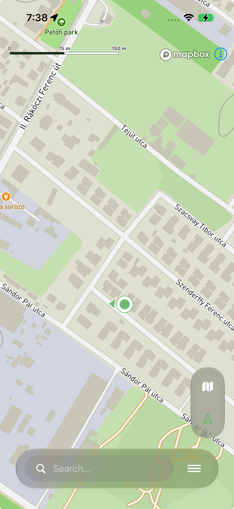

# HuKi-KMP — Plan Board

## Legend

| Status | Meaning                     |
|--------|-----------------------------|
| `[ ]`  | Not started                 |
| `[R]`  | Required for Next Release   |
| `[~]`  | In progress                 |
| `[x]`  | Done                        |
| `[-]`  | Cancelled / deprioritized   |
| `[?]`  | Questionable / spike needed |

---

## Most important features in HuKi

1. Map, text visibility
2. My location, GPS accuracy, navigating in trails, battery consumption
3. Layers (especially hiking Layer)
4. Search for places
5. Place Details
6. GPX
7. Route planner
8. Support / Billing
9. Destinations - Locally stored POIs (Peaks, Waterfalls, Valleys etc.)
10. OKT/AKT/RPDDK routes
11. Landscapes

## Release plan

### Android Go-live

Android Go-Live: will only happen if legacy HuKi's feature set is mostly covered.

## Backlog

### General / tech tasks

| Status | Feature                                                                                                                                            |
|--------|----------------------------------------------------------------------------------------------------------------------------------------------------|
| `[R]`  | SwiftUi previews don't work atm, because of Mapbox startup init blocks                                                                             |
| `[ ]`  | SwiftUi Sheets -> auto-measure height to avoid defining expanded state for every sheet, it kills 6 of the 8 constants including both iPad branches |
| `[ ]`  | Android 17 / targetSdk 37 behaviour changes — bumped targetSdk with the Gradle 9 upgrade without adapting to them                                  |
| `[ ]`  | App store preview video (optional)                                                                                                                 |
| `[ ]`  | App store header picture/video (optional)                                                                                                          |
| `[ ]`  | Distribution cert expires **2027-08-20** → re-export `.p12` and update the secret (or migrate to `match` then)                                     |
| `[?]`  | Sonar? free for open source projects. In agentic ERA i don't see too much value, it just slows down the process.                                   |

### Bugs

| Status | Scope      | Bug                                                                                                                                                                                                                                                                                                             |
|--------|------------|-----------------------------------------------------------------------------------------------------------------------------------------------------------------------------------------------------------------------------------------------------------------------------------------------------------------|
| `[R]`  | Search     | Bug: iOS. Search fails a lot. search_failed: 133 events, 41 users. Rate limit? Check Non-fatal crashlytics errors.                                                                                                                                                                                              |
| `[R]`  | Search     | Bug: iOS. location_iq screen_view is over-firing. VM / analytics bug, not real user error.                                                                                                                                                                                                                      |
| `[ ]`  | Search     | Bug: Android. DestinationsSection->overscrollEffect = null is used because of this bug. LazyRow shows spurious stretch-overscroll mid-list on fling (cards widen/shake even when not at an edge). Only on fling, not on controlled drag (scroll-to-stop). (possibly a Compose foundation fling/overscroll bug). |
| `[ ]`  | Search     | Bug: Android. Sheets closing animations dont work clicing on X, it just flashes down.                                                                                                                                                                                                                           |
| `[ ]`  | MyLocation | There is no hard timeout for a location fix. If My Location button is clicked and location fix doesnt come, it loads inifinitely. After a fixed timeout, we should show an alert "Couldn't find location, try again later"                                                                                      |

### FEATURE: Map

| Status | Scope | Task                                                                              |
|--------|-------|-----------------------------------------------------------------------------------|
| `[ ]`  | Map   | After state restoration / app kill -> restore last camera state + last opened GPX |
| `[ ]`  | Map   | Bug: GPX Menu -> Overview -> applies a big bottom padding, not necessary          |

### FEATURE: Camera panel

Inspired by DEBUG_SHOW_CAMERA_PANEL, add this as a usable feature for users. This might be useful,
they can record their exact location / zoom level with a CROSS marker.

### FEATURE: Dark Mode

| Status | Scope    | Bug                                                                                                                                   |
|--------|----------|---------------------------------------------------------------------------------------------------------------------------------------|
| `[ ]`  | DarkMode | Bug, iOS 27, found in beta. In dark mode GPX color is too bright, barely readable  |

### FEATURE: Landscape

| Status | Feature                                                                                                     |
|--------|-------------------------------------------------------------------------------------------------------------|
| `[ ]`  | Android: Add Previews to Landscape / Tablet view                                                            |
| `[ ]`  | iOS: In Landscape: Mapbox scale bar should be less wide (Android works fine, Mapbox had a built-in option)  |
| `[ ]`  | In Landscape: Mode, use Glass Panel for Layers Sheets instead of full screen sheet.                         |
| `[?]`  | In Landscape: Move the sheet to left to match Apple Maps behavior, so Map is more visible in the right side |
| `[ ]`  | Add extra padding to floating action in iPad mode, there is a lot of space                                  |
| `[ ]`  | iPad: Use overlay panels instead of Sheets -> they show up in the center of the screen                      |

### FEATURE: My Location

| Status | Scope      | Task                                                                                                                                                                                                                                                                  |
|--------|------------|-----------------------------------------------------------------------------------------------------------------------------------------------------------------------------------------------------------------------------------------------------------------------|
| `[ ]`  | MyLocation | Show altitude somewhere                                                                                                                                                                                                                                               |
| `[R]`  | MyLocation | Location permission rationale screen: show a "why we need location" priming screen before the OS prompt (and a denied → open-Settings recovery path). Location permission has a 33% blind spot. 213 granted, 10 denied_always, and 110 users (33%) never fire either. |

### FEATURE: Layers

| Status | Scope  | Task                                                                                                                                         |
|--------|--------|----------------------------------------------------------------------------------------------------------------------------------------------|
| `[R]`  | Layers | Save picked layer state permanently for users (UserPreferencesRepository). E.g. picked layer -> Satellite, it saves for the next app launch. |

### FEATURE: Search

| Status | Scope  | Task                                                                                                  |
|--------|--------|-------------------------------------------------------------------------------------------------------|
| `[R]`  | Search | Show GPX Trail collection (Természetjáró, AktívMagyarország). !!!GPX import is barely used on iOS.!!! |
| `[ ]`  | Search | No mic/voice icon. Search by voice Consider adding one between the text and hamburger.                |
| `[ ]`  | Search | In-memory LRU cache keyed by Request                                                                  |

### FEATURE: Destinations

| Status | Scope        | Task                                       |
|--------|--------------|--------------------------------------------|
| `[ ]`  | Destinations | Add Map based destinations with Landscapes |
| `[ ]`  | Destinations | Improve destinations descriptions          |

### FEATURE: Versioning + WhatsNew

| Status | Scope    | Task                                                                                                      |
|--------|----------|-----------------------------------------------------------------------------------------------------------|
| `[ ]`  | WhatsNew | Add "Follow on Facebook" section to WhatsNew's bottom.                                                    |
| `[ ]`  | WhatsNew | Version history screen under Settings: list every release + date + notes (uses the full `releases` list). |

### FEATURE: GPX Distance

Goal: Display (distance + time) in an InfoWindow on top Start / End / Middle waypoints.

| Status | Scope       | Task                                                                                                                                                                             |
|--------|-------------|----------------------------------------------------------------------------------------------------------------------------------------------------------------------------------|
| `[ ]`  | GPXDistance | When I intentionally go off the trail, it still snaps and show distance, its misleading. We can show a direct line to the route (with a label "+100m") or offer "Wandering mode" |

### FEATURE: GPX

| Status | Scope | Task                                                                              |
|--------|-------|-----------------------------------------------------------------------------------|
| `[ ]`  | GPX   | Wire iOS file picker error branch to ViewModel                                    |
| `[ ]`  | GPX   | Colored GPX                                                                       |
| `[ ]`  | GPX   | Display direction arrows. Add an option to toggle direction in GpxMenu            |
| `[ ]`  | GPX   | Display waypoint comments in a window                                             |
| `[ ]`  | GPX   | ? Display start and end location: "Around Bükk..." -> on import we can do geocode |

### FEATURE: GPX Collection

| Status | Scope         | Task                                    |
|--------|---------------|-----------------------------------------|
| `[ ]`  | GPXCollection | Implement rename                        |
| `[ ]`  | GPXCollection | Searchbar, free search text by gpx name |
| `[ ]`  | GPXCollection | Filter by distance, open date           |
| `[ ]`  | GPXCollection | "Mark Completed" GPX files              |

### FEATURE: Place Details

| Status | Scope        | Task                                                              |
|--------|--------------|-------------------------------------------------------------------|
| `[ ]`  | PlaceDetails | Search nearby button                                              |
| `[ ]`  | PlaceDetails | Allow dragging the marker to refine the pick (re-geocode on drop) |

### FEATURE: PlaceHistory

| Status | Scope        | Task                                                                                |
|--------|--------------|-------------------------------------------------------------------------------------|
| `[ ]`  | PlaceHistory | Add the PlaceSource indicator (long-tap, destinations etc.) to place history screen |

### FEATURE: Route Planner

| Status | Scope        | Task                                                                                                                                                                                                                                                                       |
|--------|--------------|----------------------------------------------------------------------------------------------------------------------------------------------------------------------------------------------------------------------------------------------------------------------------|
| `[R]`  | RoutePlanner | If GPX is opened and we do a route plan trigger, it should close the GPX first.                                                                                                                                                                                            |
| `[ ]`  | RoutePlanner | Android: the planner loses its stops on a configuration change (rotation, dark-mode toggle) — `rememberScopedViewModelStoreOwner` does not survive one. Fix with `rememberViewModelStoreOwner` once the project is on AGP 9.1 / compileSdk 37 (androidx.lifecycle 2.11.0). |
| `[ ]`  | RoutePlanner | Android: a long/fast swipe down on the planner sheet targets Hidden, which the dismiss guard rejects, so it snaps back to expanded instead of minimizing. A moderate drag minimizes correctly.                                                                             |
| `[ ]`  | RoutePlanner | Add guard if "Route Plan" next destination is too far away >50km -> Show a warning message, the stop is too far away                                                                                                                                                       |
| `[ ]`  | RoutePlanner | In-memory LRU cache keyed by RoutePlanRequest (profile + waypoints),                                                                                                                                                                                                       |
| `[ ]`  | RoutePlanner | Add an eye icon to route plan so you can "look behind" the plan and see where the hikings routes are.                                                                                                                                                                      |
| `[ ]`  | RoutePlanner | Dedicated iPad support so the sheet does not open in the middle, but in the bottom left corner.                                                                                                                                                                            |
| `[ ]`  | RoutePlanner | Deploy Graphhopper RoutePlanner (HuKi-Routing) to AWS Lightsail.                                                                                                                                                                                                           |
| `[?]`  | RoutePlanner | Use GH GZIP (poinstEncoded=true) for release builds. Client parser is needed, might be worth after self-hosted GH to reduce egress.                                                                                                                                        |
| `[?]`  | RoutePlanner | Add support for removing stops from Map during RoutePlan phase. If users click on the wps, there should be a toolbar "Delete Stop" button, which removes the waypoint.                                                                                                     |
| `[?]`  | RoutePlanner | Add support for converting to round trip through MAP. If users click on the START WP, there should be a toolbar "Finish with round trip" button, which adds the first wp as the last one.                                                                                  |

### FEATURE: Settings

| Status | Scope    | Task                                                                    |
|--------|----------|-------------------------------------------------------------------------|
| `[ ]`  | Settings | Add Increase map font size in Settings (see FEATURE: Map Label Scaling) |
| `[ ]`  | Settings | Add Theme (light/dark/system) in Settings                               |
| `[ ]`  | Settings | Add Enable/Disable two finger rotation                                  |

### FEATURE: Analytics

| Status | Scope     | Task                                                                                                                |
|--------|-----------|---------------------------------------------------------------------------------------------------------------------|
| `[ ]`  | Analytics | My Location: No-signal / GPS lost                                                                                   |
| `[ ]`  | Analytics | Search with no results                                                                                              |
| `[ ]`  | Analytics | GPX as params: attach distance_km and waypoint_count as params                                                      |
| `[ ]`  | Analytics | whats_new_shown, whats_new_dismissed                                                                                |
| `[ ]`  | Analytics | Offline - somehow monitor if user goes offline -> really helpful measurement, how many ppl experiencing it on hikes |

### FEATURE: Map Label Scaling (Global Scale Factor)

Goal: let users increase map **label/icon size** without enlarging the map graphics (roads, fills,
casings) — a text-visibility + accessibility win for the #1 feature "Map, text visibility".

Only affects icons + text labels; map geometry stays the same and zoom interpolation is preserved
by the renderer (no per-layer `text-size` expression juggling).

Approach: Mapbox's **global scale factor**, exposed on Android Compose as
`mapboxMap.symbolScaleBehavior` (set via `MapEffect`), with three modes:

Blockers:

- **Version gap**: requires Mapbox **11.26.0** (Android + iOS). We are pinned to **11.20.1** in
  `libs.versions.toml` / the iOS pod, so this needs an SDK bump + map re-verify on both platforms.
- **Experimental**: `symbolScaleBehavior` is flagged experimental/`@MapboxExperimental` and the
  signature may change in a later 11.x.

Refs:
[Mapbox blog — new scaling/styling](https://www.mapbox.com/blog/new-scaling-and-styling-capabilities-support-clear-responsive-and-expressive-map-design)
[Android Compose example](https://docs.mapbox.com/android/maps/examples/compose/global-scale-factor/)

| Status | Scope    | Task                                                                                          |
|--------|----------|-----------------------------------------------------------------------------------------------|
| `[ ]`  | Map      | Bump Mapbox SDK to 11.26.0+ (Android + iOS pod), re-verify map screens on both platforms      |
| `[ ]`  | Map      | Confirm the iOS SwiftUI equivalent of `symbolScaleBehavior` and wire it in `MapContent` (iOS) |
| `[ ]`  | Settings | Add label-size preference to `AppSettings` + DataStore (Fixed factor and/or System/Custom)    |
| `[ ]`  | Settings | Settings UI control (slider or presets) feeding the map scale factor                          |
| `[ ]`  | Map      | Apply `symbolScaleBehavior` in Android `MapContent` via `MapEffect` from the settings value   |
| `[ ]`  | Map      | Default to `SymbolScaleBehavior.system` so it respects OS accessibility font scale out of box |

### FEATURE: Support + Billing

- Support + Billing is necessary to help me keep the app free for everyone and support the
  development.
- Google: Google Play Billing API
- Apple: Apple App Store Connect, Apple Pay
- Base concept: subscriptions and one time payments. Categorized by wild animals (e.g.
  Board=1EUR/month, Owl=1EUR).
- The benefit of supporting is just visual: showing the supporter animal in various places (e.g.
  WhatsNew)

#### FEATURE: Route Planner: Wandering mode

Goal: Set a single starting point (e.g. parking), and show the straight line distance from the point.
Works like a GPX with waypoints only, set a few points and leave the user to decide which route to follow.

### FEATURE: GPX Info Panel (remaining time, distance, elevation gain/loss)

| Status | Scope    | Task                                           |
|--------|----------|------------------------------------------------|
| `[ ]`  | GpxPanel | Use GPX panel on Start / GPX Details -> hidden |
| `[ ]`  | GpxPanel | Elapsed time                                   |
| `[ ]`  | GpxPanel | Distance from Start                            |
| `[ ]`  | GpxPanel | Distance from End                              |
| `[ ]`  | GpxPanel | AVG Speed                                      |
| `[ ]`  | GpxPanel | Expected arrival based on dist/AVG speed       |

### FEATURE: GPX Collection Import/Export (device-to-device, no cloud)

Goal: share/back up the whole GPX collection between devices without cloud or auth.
Principle: separate **format** (a portable collection file) from **transport** — let the OS own
transport (AirDrop, Quick Share, Bluetooth, Files/USB, email, chat). A zipped bundle is plain data,
so an Android export imports on iOS and vice-versa.

| Status | Scope      | Task                                                                                               |
|--------|------------|----------------------------------------------------------------------------------------------------|
| `[ ]`  | GPX Export | `GpxCollectionArchiver` (expect/actual): zip `gpx/external` + generated `manifest.json`            |
| `[ ]`  | GPX Export | Export action → native share sheet (iOS ShareLink / Android ACTION_SEND + FileProvider)            |
| `[ ]`  | GPX Import | `GpxCollectionArchiver` unzip to temp, then loop each `.gpx` through `GpxStorage.saveToFileSystem` |
| `[ ]`  | GPX Import | iOS: declare imported/exported UTI + `CFBundleDocumentTypes`, handle inbound via `.onOpenURL`      |
| `[ ]`  | GPX Import | Android: `<intent-filter>` ACTION_VIEW/ACTION_SEND for `.hukigpx`/zip, read URI in `onNewIntent`   |
| `[ ]`  | GPX Import | Extend existing file pickers to also accept `.hukigpx`/`.zip`                                      |
| `[ ]`  | GPX Import | Manifest-driven import preview/summary ("X new, Y duplicates")                                     |
| `[ ]`  | GPX Import | iOS unzip needs a lib (ZIPFoundation via SPM or libarchive); Android uses `java.util.zip`          |

### FEATURE: Menu - Guides

Goal: a new section in Menu, with 1 page guides of different topics.

| Status | Scope  | Task                                      |
|--------|--------|-------------------------------------------|
| `[ ]`  | Guides | Add "Problem on route" to Guides section. |
| `[ ]`  | Guides | Route Planner                             |

#### Guides: Report problem on route

- Use MTSZ (Magyar Természetjáró Szövetség) email's to report a problem
- Include location (latitude, longitude)
- Possible link to openstreetmap.org which include the problematic point

### TECH: iOS Mapbox viewport deprecation (ViewportObserver → `$viewport` binding)

`MapProxy.viewport` (the imperative `ViewportManager`) is deprecated in Mapbox 11.20 →
`'viewport' is deprecated: Use Map(viewport:) initializer instead.` This is what
`MapView.swift` uses via `proxy.viewport?.addStatusObserver(viewportObserver)` in
`onAppear`/`onDisappear`, plus the whole `UI/Mapbox/ViewportObserver.swift` class.

- **Not deprecated (keep as-is):** `MapReader { proxy in }` → `proxy.map` (cameraState reads)
  and `proxy.location` (GPS-fix observation). `MapReader`/`MapProxy` is the sanctioned, current,
  and only way to reach these in SwiftUI — nothing better exists.
- **Only deprecated bit:** `proxy.viewport` + `ViewportStatusObserver`. The intended replacement
  is observing the two-way `$viewport` binding we already pass to `Map(viewport:)`.
  `Map.transitionsToIdleUponUserInteraction` (default `true`) writes `.idle` back into the binding
  on user pan — exactly what `ViewportObserver` detects (follow → idle/overview →
  `onFollowingDisabled`).
  Migration collapses to one `.onChange(of: viewport)` and deletes `ViewportObserver` (~50 lines +
  class).
- **Caveat / why deferred:** `Viewport` only reflects values *we* set + the idle write-back, not a
  live camera mirror (`Viewport.swift:53`). The old observer also saw `.transition` intermediate
  states; `.onChange` sees only committed values. Edge cases — pan *during* a follow animation,
  programmatic follow→overview vs. user-driven — need a real simulator pan-test (follow, then drag)
  to confirm `onFollowingDisabled` fires identically before deleting the observer. Deprecation is a
  warning, not a removal, so no urgency.

| Status | Scope | Task                                                                                                                           |
|--------|-------|--------------------------------------------------------------------------------------------------------------------------------|
| `[ ]`  | Map   | iOS: replace `ViewportObserver` + `proxy.viewport` observer with `.onChange(of: viewport)`; pan-test before deleting the class |

### FEATURE: Hike Finder

Goal: Create a search engine for hiking routes which have downloadable GPX files.
The crawler parses the most important HU hiking sites:

- aktivkalandor
- kirandulastippek
- mozgasvilag
- termeszetjaro

Input: the user can search a route by

- location / area
- distance (e.g. routes around 10km)
- difficulty
  Output: a list with links pointing to the route article inside the website.

Example:
Input: Dobogókő area, 10km, medium difficulty
Output:

- https://kirandulastippek.hu/budapest-kornyeke/dobogoko
- https://www.mozgasvilag.hu/turazas/turautak/szep-kilatasos-pilisi-cukitura-dobogokore-es-vissza
- https://www.termeszetjaro.hu/hu/tour/gyalogtura/dobogoko-ket-arca-az-eszaki-vadregenybol-a-deli-napos-oldalra/36765072/

Keep in mind:

- Comply with website terms and conditions
- All websites should be asked to participate / allow after POC is done
- Do not store the GPX files, or any legal/proprietary data
- App just redirects the user to the link in a browser

- Create a crawler for hiking collection websites (Term, AktivM etc.).
- Create a DB based on the crawled info.
- Build a search engine on top of it.

---

## Completed

| Feature        | Notes                                                        |
|----------------|--------------------------------------------------------------|
| Map            | Mapbox                                                       |
| My location    | Mapbox + Google Fused Location Provider                      |
| Layers         | Mapbox Outdoor, Street, Satellite, Hiking                    |
| Search         | Place Autocomplete, Destinations, Recent GPXs, Recent Places |
| Menu           | Features, Contact, Supporters                                |
| GPX            | GPX Import, Layers                                           |
| GPX Details    | GPX Details Sheet with basic info, Maps Navigation           |
| GPX Menu       | GPX Visibility, Overview, Clear, Distances                   |
| GPX Collection | GPX File list view, GPX Tutorial screen                      |
| GPX Metadata   | Store GPX Metadata in a JSON                                 |
| Place History  | Place History list view                                      |
| Destinations   | Destinations with Popular, Ladnscapes, Nearby                |
| WhatsNew       | Versioning, WhatsNew Sheet                                   |
| Guides         | GPX Guide, Trail Symbols Guide                               |
