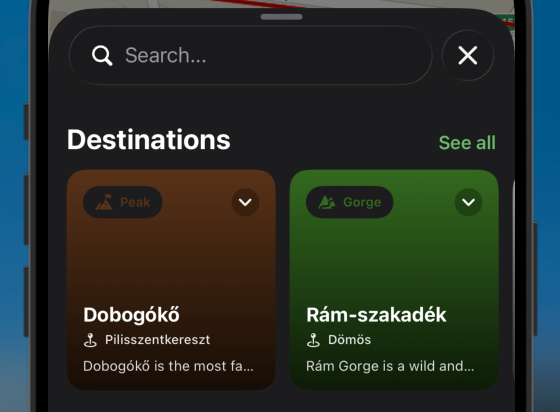

# HuKi-KMP — Plan Board

## Legend

| Status | Meaning                   |
|--------|---------------------------|
| `[ ]`  | Not started               |
| `[L]`  | Required for Go-Live      |
| `[~]`  | In progress               |
| `[x]`  | Done                      |
| `[-]`  | Cancelled / deprioritized |

---

## Most important features in HuKi

1. Map, text visibility
2. My location, GPS accuracy, navigating in trails, battery consumption
3. Layers (especially hiking Layer)
4. Search for places
5. Place Details
6. GPX
7. Route planner
8. Support / Billing
9. Destinations - Locally stored POIs (Peaks, Waterfalls, Valleys etc.)
10. OKT/AKT/RPDDK routes
11. Landscapes

## Release plan

1. Feature complete for iOS Go-Live - Map, My Location, Layers, Search, GPX, Settings
2. Release process setup: CD - Fastlane, versioning, release notes, store presence etc.
3. Apple developer account registration
4. iOS Go-Live
5. Android Go-Live: will only happen if legacy HuKi's feature set is mostly covered

### Go-live remaining features

- Recent Places -> from LIQ Autocomplete / Destinations / Long tap place details
- Place Details -> long tap on map AND destinations
- Display (distance + time) in an InfoWindow on top Start / End / Waypoint points
- Destinations screen with filtering
- Versioning, WhatsNews

## Backlog

### General / tech tasks

| Status | Feature                                                                                          |
|--------|--------------------------------------------------------------------------------------------------|
| `[L]`  | Launcher icon Android + iOS                                                                      |
| `[L]`  | Google Analytics                                                                                 |                                                 
| `[L]`  | LogLevel.ALL only in debug                                                                       |
| `[L]`  | Register Apple Developer Account                                                                 |
| `[L]`  | CD on Apple Store                                                                                |
| `[L]`  | Implement T&C on huki.hu                                                                         |
| `[ ]`  | SwiftUi previews don't work atm, because of Mapbox startup init blocks                           |
| `[ ]`  | Update Kotlin + Gradle 9                                                                         |
| `[ ]`  | Sonar? free for open source projects                                                             |
| `[ ]`  | Check project against Swift agent skills in XCode                                                |
| `[ ]`  | GitHub smart labels, E.g.: https://github.com/balazsgerlei/ScreenLit/blob/main/README.md?plain=1 |

### Bugs

| Status | Scope      | Bug                                                                                                                                                                                                                                                                                                             |
|--------|------------|-----------------------------------------------------------------------------------------------------------------------------------------------------------------------------------------------------------------------------------------------------------------------------------------------------------------|
| `[ ]`  | Map        | Bug: The GPX route on map, Start / End destinations should be always on top compared to Waypoint / Middle points (marker placement order issue)                                                                                                                                                                 |
| `[ ]`  | CI         | Bug: iOS Simulator 18 is used (preferred: 26) and only smoke test suite is runnable on CI                                                                                                                                                                                                                       |
| `[ ]`  | Search     | Bug: Android. DestinationsSection->overscrollEffect = null is used because of this bug. LazyRow shows spurious stretch-overscroll mid-list on fling (cards widen/shake even when not at an edge). Only on fling, not on controlled drag (scroll-to-stop). (possibly a Compose foundation fling/overscroll bug). |
| `[ ]`  | Search     | UI Bug: Android. In GpxCollection + Settings, it use group dividers as separators, it's more like iOS design, it should be transparent sapces instead. (cmt: latest Android SDK shows no spaces, as iOS...)                                                                                                     |
| `[ ]`  | MyLocation | There is no hard timeout for a location fix. If My Location button is clicked and location fix doesnt come, it loads inifinitely. After a fixed timeout, we should show an alert "Couldn't find location, try again later"                                                                                      |

### FEATURE: Map

| Status | Scope | Task                                                                              |
|--------|-------|-----------------------------------------------------------------------------------|
| `[ ]`  | Map   | After state restoration / app kill -> restore last camera state + last opened GPX |

### FEATURE: Dark Mode

| Status | Scope    | Bug                                                                                                                                                    |
|--------|----------|--------------------------------------------------------------------------------------------------------------------------------------------------------|
| `[ ]`  | DarkMode | Bug, iOS 27. In dark mode GPX color is too bright, barely readable                                  |

### FEATURE: My Location

| Status | Scope      | Task                    |
|--------|------------|-------------------------|
| `[ ]`  | MyLocation | Show altitude somewhere |

### FEATURE: Layers

| Status | Scope  | Task                                                                                                                                         |
|--------|--------|----------------------------------------------------------------------------------------------------------------------------------------------|
| `[ ]`  | Layers | Save picked layer state permanently for users (UserPreferencesRepository). E.g. picked layer -> Satellite, it saves for the next app launch. |

### FEATURE: Search

| Status | Scope  | Task                                                                                                                                                                          |
|--------|--------|-------------------------------------------------------------------------------------------------------------------------------------------------------------------------------|
| `[L]`  | Search | Use PlaceHistory + Destinations as well as data sources in SearchResults. They populate search results immediately (without LIQ debounce and without meeting minChar=3 limit) |
| `[ ]`  | Search | Show GPX Trail collection (Természetjáró, AktívMagyarország)                                                                                                                  |
| `[ ]`  | Search | No mic/voice icon. Search by voice Consider adding one between the text and hamburger.                                                                                        |

#### Add Place History items to Search -> Autocomplete

- Local DB: fire on every keystroke, no debounce — it's an instant indexed read, that's the whole
  point.
- clock or pin icon), remote results below
- LocationIQ: debounced (~300ms) — don't spam the API mid-typing.
- Dedupe, so results from Place History is not shown again.

### FEATURE: Destinations

| Status | Scope        | Task                                                                                                               |
|--------|--------------|--------------------------------------------------------------------------------------------------------------------|
| `[ ]`  | Destinations | Add Map based destinations with Landscapes                                                                         |
| `[ ]`  | Destinations | Bug: not readable category label  |

### FEATURE: Versioning + WhatsNew

**Decisions (resolved):**

- **Versioning**: one **shared marketing version** (e.g. `1.4.0`) identical on both platforms;
  **independent build numbers** per platform (`versionCode` / `CURRENT_PROJECT_VERSION`).
- **Build numbers = Fastlane owns them at release.** At release Fastlane sets a monotonic number
  from the store (`latest_testflight_build_number + 1` iOS / Play track max `versionCode` + 1
  Android) or CI `run_number`. Until Fastlane lands, `version.properties` carries **temporary
  hardcoded** `androidBuildNumber` / `iosBuildNumber` placeholders that local/interim builds read.
  No date formula, no build-time computation.
- **Release notes**: **single source** per version → feeds Play Store, App Store, **and** in-app
  WhatsNew.
- **Source of truth**: **Fastlane-managed** long-term. Sequencing = **Plan B**: introduce a minimal
  interim SoT now (`version.properties` at repo root) so both platforms read one value and in-app
  WhatsNew works; when the Fastlane/CD task lands it adopts that same file for bumping (nothing
  thrown away). Depends on: "Release process setup: CD - Fastlane" for the store-facing half.

**WhatsNew source layout (resolved):**

- One **version-named dir per release** (no `latest` alias, no rename step):
  `tools/release/whatsnew/v<version>/` — e.g. `v0.9/`. The dir matching `appVersion` is the
  current one; older dirs are the store/audit history.
- Per dir: locale-split notes (`whatsnew-en-US.md`, `whatsnew-hu-HU.md`) — **store-facing** (
  Fastlane
  feeds these to Play/App Store) — + `metadata.json` (`releaseDate`, and an optional **in-app-only**
  `message`). **`version` is not stored here** — it comes from `version.properties` (`appVersion`);
  the dir name is only the lookup key.
- **In-app-only `message`** (welcome / thanks-to-supporters, per the mockup): stored in
  `metadata.json` as inline locale maps (`title` / `body`), **never** sent to stores (it's not in
  the
  `.md`). Generated into moko strings like the notes.
- `WhatsNew` domain model (per release) = `version` + `releaseDate` (from `metadata.json`) +
  `releaseNotes: StringDesc` + optional `message: WhatsNewMessage?` (`title` / `body` as
  `StringDesc`)
  — all moko-resolved by system language, like other localized text.
- The **social/Follow card** (e.g. Facebook) is **app-global**, not per-release — a moko string +
  constant URL rendered on every sheet; not stored in per-version metadata.
- Generator reads **all** `v*` dirs → (a) `strings_whatsnew.xml` into moko `base/` (en) + `hu/`
  (gitignored, generated) with one `whatsnew_v<ver>` string per release, and (b) a `WhatsNewContent`
  object with `currentVersion` (= `appVersion`) + `releases: List<Entry>` (each `notes` is a moko
  `StringResource`), sorted newest-first (semantic version compare). **Locale is solved by moko**
  (system language + automatic `base` fallback) — no `languageCode` plumbing. moko's `generateMR*`
  tasks depend on `generateWhatsNew`. Serves the first-open bottom sheet (current entry) **and** a
  future Version history screen (full list).

| Status | Scope    | Task                                                                                                                                                                                                                                                                                                                                                                                    |
|--------|----------|-----------------------------------------------------------------------------------------------------------------------------------------------------------------------------------------------------------------------------------------------------------------------------------------------------------------------------------------------------------------------------------------|
| `[x]`  | WhatsNew | Changelog layout: version-named dir `tools/release/whatsnew/v<version>/` with locale `.md` + `metadata.json` (releaseDate).                                                                                                                                                                                                                                                             |
| `[x]`  | WhatsNew | Add `version.properties` (repo root): `appVersion` + **temporary hardcoded** `androidBuildNumber` / `iosBuildNumber` (Fastlane overrides at release).                                                                                                                                                                                                                                   |
| `[x]`  | WhatsNew | Wire Android: `versionName` ← `appVersion`, `versionCode` ← `androidBuildNumber` in `composeApp/build.gradle.kts`.                                                                                                                                                                                                                                                                      |
| `[x]`  | WhatsNew | Wire iOS: `generateVersionXcconfig` Gradle task (buildSrc, mirrors `GenerateSecretsTask`) → `Version.xcconfig` (`#include`d by `Config.xcconfig`, runs via `embedAndSignAppleFrameworkForXcode`); `MARKETING_VERSION` ← `appVersion`, `CURRENT_PROJECT_VERSION` ← `iosBuildNumber`.                                                                                                     |
| `[x]`  | WhatsNew | `generateWhatsNew` Gradle task (buildSrc) → generated moko `strings_whatsnew.xml` (base+hu, gitignored) + `WhatsNewContent` (`currentVersion` + `releases: List<Entry>` w/ moko `StringResource` notes, all `v*` dirs, semantic sort). moko `generateMR*` depends on it. No runtime file IO.                                                                                            |
| `[x]`  | WhatsNew | `WhatsNewMapper.kt`: `Entry.toWhatsNew()` (parse `releaseDate` → `LocalDate`, wrap notes `StringResource` → `StringDesc`) + `toCurrentWhatsNew` / `toWhatsNewHistory`. No `languageCode` (moko resolves locale). Unit-tested.                                                                                                                                                           |
| `[x]`  | WhatsNew | In-app-only `message` (welcome/thanks): optional `message` (`title`/`body`) in `metadata.json` (locale maps) → generated moko strings + `WhatsNewContent.Entry.message` → `WhatsNew.message: WhatsNewMessage?`. Generator parses JSON via `JsonSlurper`. Unit-tested (present/absent).                                                                                                  |
| `[x]`  | WhatsNew | `WhatsNewRepository` (commonMain, Koin): `currentWhatsNew` + `whatsNewHistory` (via mapper), `shouldShowWhatsNew()` (`lastSeenVersion` != `currentVersion`; shows on fresh install too), `markCurrentWhatsNewSeen()`. `WHATS_NEW_LAST_SEEN_VERSION` DataStore key. Unit-tested (fake DataStore).                                                                                        |
| `[x]`  | WhatsNew | **Android** bottom sheet: `Sheet.WhatsNew` (modal) + `WhatsNewBottomSheet` (header w/ app icon + version pill + month-year, notes card, optional message card, Facebook card). `MainViewModel.initWhatsNew()`: if `shouldShowWhatsNew()` → show + `markCurrentWhatsNewSeen()` (mark-on-show). `String.toReleaseNoteLines()` mapper (unit-tested) turns the notes markdown into bullets. |
| `[L]`  | WhatsNew | **iOS** bottom sheet (SwiftUI) — same content, driven by the same `Sheet.WhatsNew` state.                                                                                                                                                                                                                                                                                               |
| `[L]`  | WhatsNew | (Fastlane/CD task) Project the `v<version>` dir into Fastlane metadata; `supply`/`deliver` feed the changelog to the stores; adopt `version.properties` for bumping.                                                                                                                                                                                                                    |
| `[ ]`  | WhatsNew | In user pereferences save the user INSTALL date.                                                                                                                                                                                                                                                                                                                                        |
| `[ ]`  | WhatsNew | Add "Follow on Facebook" section to WhatsNew's bottom.                                                                                                                                                                                                                                                                                                                                  |
| `[ ]`  | WhatsNew | Version history screen under Settings: list every release + date + notes (uses the full `releases` list).                                                                                                                                                                                                                                                                               |

### FEATURE: Route Planner: Wandering mode

Goal: Set a single starting point (e.g. parking), and show the straight line distance from the
point.
Works like a GPX with waypoints only, set a few points and leave the user to decide which route to
follow.

### FEATURE: GPX Distance

Goal: Display (distance + time) in an InfoWindow on top Start / End / Middle waypoints.

| Status | Scope       | Task                                                                                                                                                                             |
|--------|-------------|----------------------------------------------------------------------------------------------------------------------------------------------------------------------------------|
| `[ ]`  | GPXDistance | When I intentionally go off the trail, it still snaps and show distance, its misleading. We can show a direct line to the route (with a label "+100m") or offer "Wandering mode" |

### FEATURE: GPX

| Status | Scope | Task                                                                              |
|--------|-------|-----------------------------------------------------------------------------------|
| `[ ]`  | GPX   | Wire iOS file picker error branch to ViewModel                                    |
| `[ ]`  | GPX   | Colored GPX                                                                       |
| `[ ]`  | GPX   | Display direction arrows. Add an option to toggle direction in GpxMenu            |
| `[ ]`  | GPX   | Display waypoint comments in a window                                             |
| `[ ]`  | GPX   | ? Display start and end location: "Around Bükk..." -> on import we can do geocode |

### FEATURE: GPX Details

| Status | Scope      | Task                                      |
|--------|------------|-------------------------------------------|
| `[ ]`  | GPXDetails | Show as secondary button "Share GPX file" |

### FEATURE: GPX Collection

| Status | Scope         | Task                                                        |
|--------|---------------|-------------------------------------------------------------|
| `[L]`  | GPXTutorial   | T&C link                                                    |                                                                                                                   |
| `[ ]`  | GPXCollection | Implement share                                             |
| `[ ]`  | GPXCollection | Implement rename                                            |
| `[ ]`  | GPXCollection | "Imported vs Route Planner" badges / chips OR icon to start |
| `[ ]`  | GPXCollection | Searchbar, free search text by gpx name                     |
| `[ ]`  | GPXCollection | Filter by distance, open date                               |
| `[ ]`  | GPXCollection | "Mark Completed" GPX files                                  |

### FEATURE: Place Details (from Search + Long Tap)

| Status | Scope        | Task                                                                      |
|--------|--------------|---------------------------------------------------------------------------|
| `[ ]`  | PlaceDetails | On long click show a PlacePicker marker with (CheckMark: done, X: cancel) |
| `[ ]`  | PlaceDetails | On CheckMark: done show PlaceDetails sheet                                |
| `[ ]`  | PlaceDetails | Reverse geocode with LocationIQ                                           |
| `[ ]`  | PlaceDetails | Show content what is already shown with autocomplete: @Place model        |
| `[ ]`  | PlaceDetails | Search nearby button                                                      |
| `[ ]`  | PlaceDetails | Show Place Details for Destinations                                       |

### FEATURE: Settings

| Status | Scope    | Task                                                                    |
|--------|----------|-------------------------------------------------------------------------|
| `[ ]`  | Settings | Add Increase map font size in Settings (see FEATURE: Map Label Scaling) |
| `[ ]`  | Settings | Add Theme (light/dark/system) in Settings                               |
| `[ ]`  | Settings | Add Enable/Disable two finger rotation                                  |

### FEATURE: Map Label Scaling (Global Scale Factor)

Goal: let users increase map **label/icon size** without enlarging the map graphics (roads, fills,
casings) — a text-visibility + accessibility win for the #1 feature "Map, text visibility".

Approach: Mapbox's **global scale factor**, exposed on Android Compose as
`mapboxMap.symbolScaleBehavior` (set via `MapEffect`), with three modes:

- `SymbolScaleBehavior.fixed(factor)` — manual multiplier, range **0.5×–3×**
- `SymbolScaleBehavior.system` — auto-follows the OS font-scale accessibility setting (free win)
- `SymbolScaleBehavior.system { fontScale -> ... }` — custom mapping/clamp of the OS font scale

Only affects icons + text labels; map geometry stays the same and zoom interpolation is preserved
by the renderer (no per-layer `text-size` expression juggling).

Blockers:

- **Version gap**: requires Mapbox **11.26.0** (Android + iOS). We are pinned to **11.20.1** in
  `libs.versions.toml` / the iOS pod, so this needs an SDK bump + map re-verify on both platforms.
- **Experimental**: `symbolScaleBehavior` is flagged experimental/`@MapboxExperimental` and the
  signature may change in a later 11.x.

Refs:
[Mapbox blog — new scaling/styling](https://www.mapbox.com/blog/new-scaling-and-styling-capabilities-support-clear-responsive-and-expressive-map-design)
[Android Compose example](https://docs.mapbox.com/android/maps/examples/compose/global-scale-factor/)

| Status | Scope    | Task                                                                                          |
|--------|----------|-----------------------------------------------------------------------------------------------|
| `[ ]`  | Map      | Bump Mapbox SDK to 11.26.0+ (Android + iOS pod), re-verify map screens on both platforms      |
| `[ ]`  | Map      | Confirm the iOS SwiftUI equivalent of `symbolScaleBehavior` and wire it in `MapContent` (iOS) |
| `[ ]`  | Settings | Add label-size preference to `AppSettings` + DataStore (Fixed factor and/or System/Custom)    |
| `[ ]`  | Settings | Settings UI control (slider or presets) feeding the map scale factor                          |
| `[ ]`  | Map      | Apply `symbolScaleBehavior` in Android `MapContent` via `MapEffect` from the settings value   |
| `[ ]`  | Map      | Default to `SymbolScaleBehavior.system` so it respects OS accessibility font scale out of box |

### FEATURE: Support + Billing

- Support + Billing is necessary to help me keep the app free for everyone and support the
  development.
- Google: Google Play Billing API
- Apple: Apple App Store Connect, Apple Pay
- Base concept: subscriptions and one time payments. Categorized by wild animals (e.g.
  Board=1EUR/month, Owl=1EUR).
- The benefit of supporting is just visual: showing the supporter animal in various places (e.g.
  WhatsNew)

### FEATURE: Route Planner

- Graphhopper API
- Most of the code can be reused from legacy HuKi
- Storage: `gpx/routeplanner/` (sibling of `gpx/external/`)

| Status | Scope        | Task                                                                                     |
|--------|--------------|------------------------------------------------------------------------------------------|
| `[ ]`  | RoutePlanner | Save created routes to `gpx/routeplanner/` (sibling of `gpx/external/`)                  |
| `[ ]`  | RoutePlanner | Serialize a created route to `.gpx` (persist to collection sandbox or temp for share)    |
| `[ ]`  | RoutePlanner | Share created track via share sheet (iOS ShareLink / Android ACTION_SEND + FileProvider) |

### FEATURE: GPX Info Panel (remaining time, distance, elevation gain/loss)

| Status | Scope    | Task                                           |
|--------|----------|------------------------------------------------|
| `[ ]`  | GpxPanel | Use GPX panel on Start / GPX Details -> hidden |
| `[ ]`  | GpxPanel | Elapsed time                                   |
| `[ ]`  | GpxPanel | Distance from Start                            |
| `[ ]`  | GpxPanel | Distance from End                              |
| `[ ]`  | GpxPanel | AVG Speed                                      |
| `[ ]`  | GpxPanel | Expected arrival based on dist/AVG speed       |

### FEATURE: GPX Collection Import/Export (device-to-device, no cloud)

Goal: share/back up the whole GPX collection between devices without cloud or auth.
Principle: separate **format** (a portable collection file) from **transport** — let the OS own
transport (AirDrop, Quick Share, Bluetooth, Files/USB, email, chat). A zipped bundle is plain data,
so an Android export imports on iOS and vice-versa.

| Status | Scope      | Task                                                                                               |
|--------|------------|----------------------------------------------------------------------------------------------------|
| `[ ]`  | GPX Export | `GpxCollectionArchiver` (expect/actual): zip `gpx/external` + generated `manifest.json`            |
| `[ ]`  | GPX Export | Export action → native share sheet (iOS ShareLink / Android ACTION_SEND + FileProvider)            |
| `[ ]`  | GPX Import | `GpxCollectionArchiver` unzip to temp, then loop each `.gpx` through `GpxStorage.saveToFileSystem` |
| `[ ]`  | GPX Import | iOS: declare imported/exported UTI + `CFBundleDocumentTypes`, handle inbound via `.onOpenURL`      |
| `[ ]`  | GPX Import | Android: `<intent-filter>` ACTION_VIEW/ACTION_SEND for `.hukigpx`/zip, read URI in `onNewIntent`   |
| `[ ]`  | GPX Import | Extend existing file pickers to also accept `.hukigpx`/`.zip`                                      |
| `[ ]`  | GPX Import | Manifest-driven import preview/summary ("X new, Y duplicates")                                     |
| `[ ]`  | GPX Import | iOS unzip needs a lib (ZIPFoundation via SPM or libarchive); Android uses `java.util.zip`          |

### FEATURE: Menu - Guides

Goal: a new section in Menu, with 1 page guides of different topics:

- GPX Guide - already existing via GPX Collection
- Trail markers
- Problem on route

#### Guides: Report problem on route

- Use MTSZ (Magyar Természetjáró Szövetség) email's to report a problem
- Include location (latitude, longitude)
- Possible link to openstreetmap.org which include the problematic point

### TECH: iOS Mapbox viewport deprecation (ViewportObserver → `$viewport` binding)

`MapProxy.viewport` (the imperative `ViewportManager`) is deprecated in Mapbox 11.20 →
`'viewport' is deprecated: Use Map(viewport:) initializer instead.` This is what
`MapView.swift` uses via `proxy.viewport?.addStatusObserver(viewportObserver)` in
`onAppear`/`onDisappear`, plus the whole `UI/Mapbox/ViewportObserver.swift` class.

- **Not deprecated (keep as-is):** `MapReader { proxy in }` → `proxy.map` (cameraState reads)
  and `proxy.location` (GPS-fix observation). `MapReader`/`MapProxy` is the sanctioned, current,
  and only way to reach these in SwiftUI — nothing better exists.
- **Only deprecated bit:** `proxy.viewport` + `ViewportStatusObserver`. The intended replacement
  is observing the two-way `$viewport` binding we already pass to `Map(viewport:)`.
  `Map.transitionsToIdleUponUserInteraction` (default `true`) writes `.idle` back into the binding
  on user pan — exactly what `ViewportObserver` detects (follow → idle/overview →
  `onFollowingDisabled`).
  Migration collapses to one `.onChange(of: viewport)` and deletes `ViewportObserver` (~50 lines +
  class).
- **Caveat / why deferred:** `Viewport` only reflects values *we* set + the idle write-back, not a
  live camera mirror (`Viewport.swift:53`). The old observer also saw `.transition` intermediate
  states; `.onChange` sees only committed values. Edge cases — pan *during* a follow animation,
  programmatic follow→overview vs. user-driven — need a real simulator pan-test (follow, then drag)
  to confirm `onFollowingDisabled` fires identically before deleting the observer. Deprecation is a
  warning, not a removal, so no urgency.

| Status | Scope | Task                                                                                                                           |
|--------|-------|--------------------------------------------------------------------------------------------------------------------------------|
| `[ ]`  | Map   | iOS: replace `ViewportObserver` + `proxy.viewport` observer with `.onChange(of: viewport)`; pan-test before deleting the class |

---

## Completed

| Feature        | Notes                                                        |
|----------------|--------------------------------------------------------------|
| Map            | Mapbox                                                       |
| My location    | Mapbox + Google Fused Location Provider                      |
| Layers         | Mapbox Outdoor, Street, Satellite, Hiking                    |
| Search         | Place Autocomplete, Destinations, Recent GPXs, Recent Places |
| Menu           | Features, Contact, Supporters                                |
| GPX            | GPX Import, Layers                                           |
| GPX Details    | GPX Details Sheet with basic info, Maps Navigation           |
| GPX Menu       | GPX Visibility, Overview, Clear, Distances                   |
| GPX Collection | GPX File list view, GPX Tutorial screen                      |
| GPX Metadata   | Store GPX Metadata in a JSON                                 |
| Place History  | Place History list view                                      |
| Destinations   | Destinations with Popular, Ladnscapes, Nearby                |
